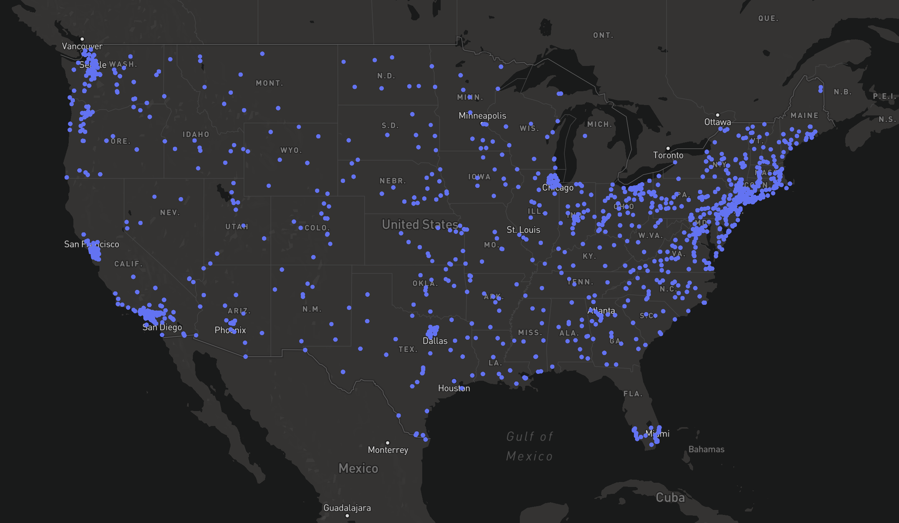

# ProtestLocations

This repo was created as a data visualization exercise to map all the major BLM protest that have happened in the United States.

The end result looks like the following below:

Every blue dot represents a protest and hovering over the data point launches a popup that details the location and some information about the protest. For example, when was the protest? how many people showed up? what was the protesting route? and, occasionally, what was the police responce like? 

Lastly, the map also allows you to zoom into each state and see some of the previous protests that have happened in your state. 

---------------------------------------------------------------
Will post the map.html to my github.io site soon
and the data.txt to kaggle datasets. 

